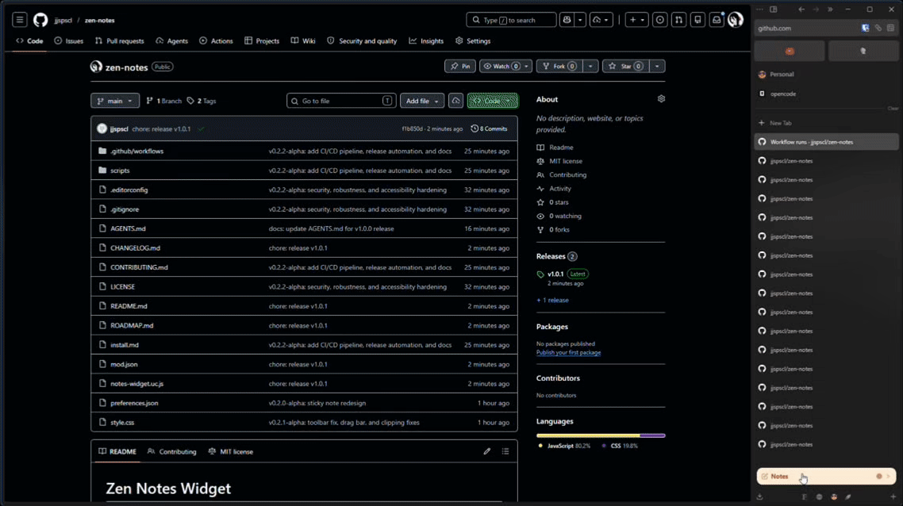

# Zen Notes Widget

A persistent, colorful sticky-note widget for [Zen Browser](https://zen-browser.app/), pinned to the bottom of the sidebar just above the workspace indicators.

## Features

- **Persistent Notes** — Your note survives browser restarts (stored as rich text HTML)
- **Collapsible** — Click the header to hide/show the editor
- **Pastel Card Colors** — Choose from 5 sticky-note colors (yellow, orange, purple, green, blue)
- **Rich Text** — Bold and italic formatting with toolbar buttons and keyboard shortcuts (`Ctrl+B`, `Ctrl+I`)
- **Zen Theme Match** — Automatically adapts to light and dark modes
- **Auto-save** — Saves as you type (debounced)
- **Last Edited** — Shows the date of your most recent edit
- **Resizable** — Drag the bar above the widget to adjust height
- **Text Wrapping** — Long text wraps inside the editor without expanding the sidebar

## Installation

> **Quick start**: See [install.md](./install.md) for detailed step-by-step instructions including troubleshooting.

### Prerequisites

You need a `userChrome.js` loader installed in Zen Browser. If you don't have one:

1. Install [fx-autoconfig](https://github.com/MrOtherGuy/fx-autoconfig) or [zen-autoconfig-script](https://github.com/RayZ3R0/zen-autoconfig-script)
2. Follow their setup instructions
3. Restart Zen Browser

### Quick Install

1. Download the latest release ZIP from [GitHub Releases](https://github.com/jjspscl/zen-notes/releases)
2. Extract and copy `zen-notes/chrome/` contents into your Zen profile `chrome/` folder
3. Copy `zen-notes/userChrome.css` into `chrome/userChrome.css` (or append to existing)
4. Clear startup cache: `about:support` → **"Clear startup cache"**
5. Restart Zen Browser

## Usage

- **Type** in the editor — your note saves automatically as rich text
- **Bold / Italic** — Use the toolbar buttons or `Ctrl+B` / `Ctrl+I`
- **Change Color** — Click the colored dot in the header, then pick a swatch
- **Click "Notes"** to collapse or expand the widget
- Your note persists across browser sessions

## Uninstall

1. Remove `chrome/JS/notes-widget.uc.js`
2. Remove the `@import` or CSS rules from `chrome/userChrome.css`
3. Restart Zen Browser

To also clear your saved note, go to `about:config`, search for `zen.notes.content`, and reset the preference.

## Compatibility

- **Zen Browser**: 1.7.0+
- **Requires**: `fx-autoconfig` or compatible `userChrome.js` loader

## Roadmap

See [ROADMAP.md](./ROADMAP.md) for milestones and current status.

## Contributing

See [CONTRIBUTING.md](./CONTRIBUTING.md) for development setup, conventional commits, and testing guidelines.

## Changelog

See [CHANGELOG.md](./CHANGELOG.md) for version history.

## License

MIT
